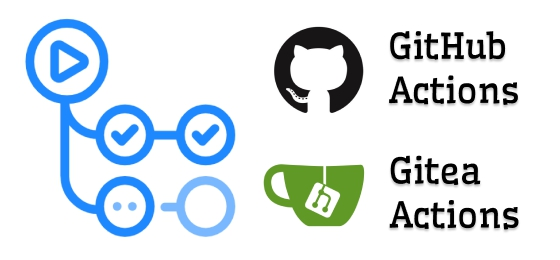

<p align="center">
    
</p>

# Creating a release in Gitea

[](https://github.com/rosven9856/gitea_creating_release_action/blob/master/LICENSE)

This action will create a new release in the Gitea system using the API and output all debugging information to the log.
See from detail https://docs.gitea.com/api/1.20/#tag/repository/operation/repoCreateRelease

## Inputs

### `gitea_schema`
Gitea schema.

### `gitea_host`
**Required** Gitea host.

### `gitea_organization`
**Required** Gitea organization or user.

### `gitea_repo`
**Required** Gitea repository.

### `access_token`
**Required** Gitea access token for interacting with the API.

### `release_body`
**Required** Option {body} in request to api.

### `release_draft`
**Required** Option {draft} in request to api.

### `release_name`
**Required** Option {name} in request to api.

### `release_prerelease`
**Required** Option {prerelease} in request to api.

### `release_tag_name`
**Required** Option {tag_name} in request to api.

### `release_target_commitish`
**Required** Option {target_commitish} in request to api.

## Example usage

### GitHub
```yml
uses: rosven9856/gitea_creating_release_action@master
with:
  gitea_schema: "https"
  gitea_host: "gitea.example.org"
  gitea_organization: "organization"
  gitea_repo: "repository"
  access_token: "${{ secrets.GITEA_ACCESS_TOKEN }}"
  release_body: ""
  release_draft: "false"
  release_name: "release_name"
  release_prerelease: "false"
  release_tag_name: "1.0.0"
  release_target_commitish: "master"
```

### Gitea
```yml
uses: https://gitea.com/rosven9856/gitea_creating_release_action.git@master
with:
  gitea_schema: "https"
  gitea_host: "gitea.example.org"
  gitea_organization: "organization"
  gitea_repo: "repository"
  access_token: "${{ secrets.GITEA_ACCESS_TOKEN }}"
  release_body: ""
  release_draft: "false"
  release_name: "release_name"
  release_prerelease: "false"
  release_tag_name: "1.0.0"
  release_target_commitish: "master"
```

## Reach out to us

### You found a bug or want to propose a feature?

* File an issue here on GitHub: [](https://github.com/rosven9856/gitea_creating_release_action/issues/new).
* File an issue here on Gitea: [](https://gitea.com/rosven9856/gitea_creating_release_action/issues/new).
